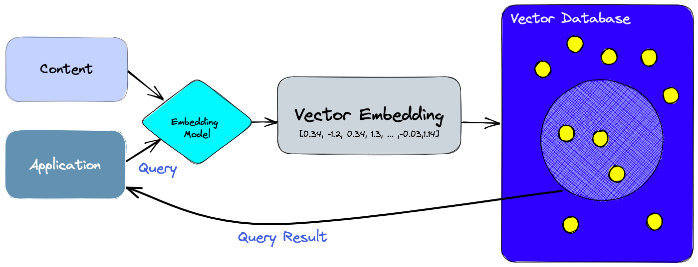

<h1>Hybrid Search Engine</h1>

<h4>What is a hybrid search engine?</h4>
Hybrid vector search is combination of traditional keyword search and modern dense vector search (semantic search).

By combining the strengths of traditional text-based search algorithms with the visual recognition capabilities of deep learning models, hybrid vector search allows users to search for products using a combination of text and images. This can be especially useful for product searches, where customers may not know the exact name or details of the item they are looking for.

This project is inspired from https://github.com/pinecone-io/examples/blob/master/learn/search/hybrid-search/ecommerce-search/ecommerce-search.ipynb
and creates a small web app using Flask to showcase a hybrid e-commerce search engine

<h4>Essential pre-reads for this topic:</h4>
Before you jump in to use this app, start by reading what [Pinecone](https://www.pinecone.io/) is and what are [Vector Databases](https://www.pinecone.io/learn/vector-database/).



This project uses open source models from Huggingface. [CLIP](https://huggingface.co/sentence-transformers/clip-ViT-B-32) for creating the embeddings for the images 
and [A multilingual clip mode](https://huggingface.co/sentence-transformers/clip-ViT-B-32-multilingual-v1) for the text queries.

We will also use the [fashion dataset](https://huggingface.co/datasets/ashraq/fashion-product-images-small) for this app.

<h4>Setting up the application</h4>
Install the required dependencies
```
pip install -r requirements.txt
```

If you have not already setup Pinecone, use this [Quickstart](https://docs.pinecone.io/docs/quickstart) guide to get your free API key.
The api key need to be set in the python environment as "PINECONE_API_KEY" 

Next, run the setup file while which will download the dataset from HuggingFace and create the vector embeddings:
```
python setup.py
```
This could take a while to run

After the setup is complete, run the flask app

```
flask --app app.py --debug run 
```
and open http://127.0.0.1:5000/ after the app starts


